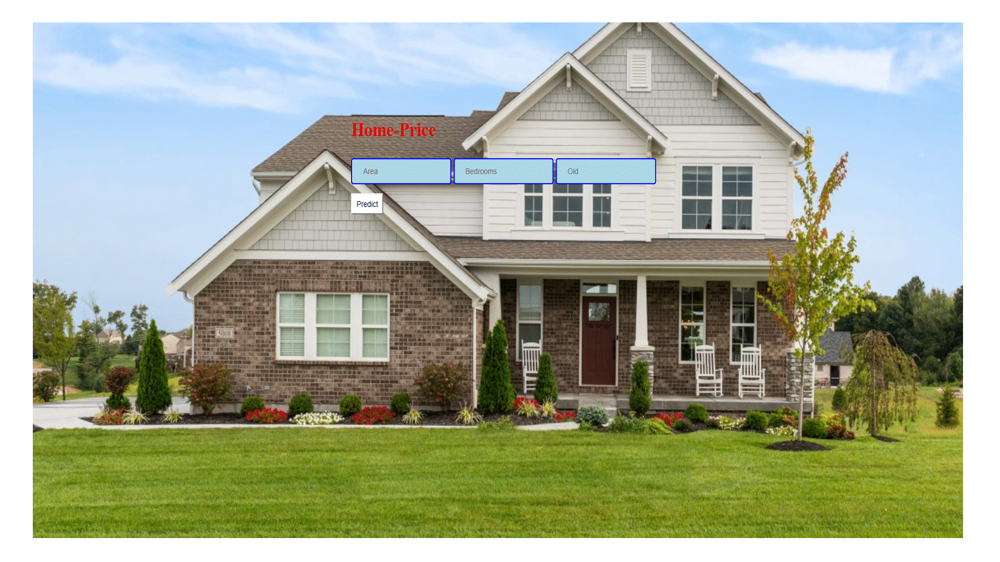
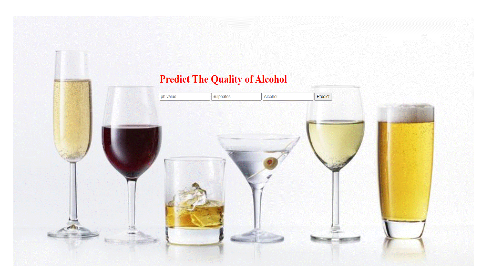
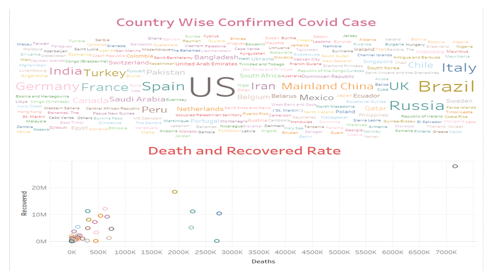
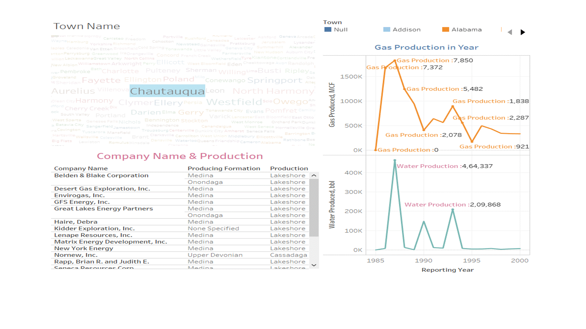

# My_Portfolio

# Madhusudan Prajapati

# Projects

## [**Project 1: Data Analysis with Pandas**](https://github.com/Madhu2511995/Pandas-Library)

  * Pandas is a fast, powerful, flexible and easy to use open source data analysis and manipulation tool in Python.
   
   
   
   
   
## [**Project 2: Loan-Predication**](https://github.com/Madhu2511995/Loan-Predication)   
   
  * The dataset has **'Response'**,**'Age'**,**'Job'**,**'Marital Status'**,**'Education'**,**'balance'**,**'housing'**,and **'loan'** columns. It has **'1816 row'** and **'8 column'**'. 
  * From the dataset Predict, a person can get loan **'Yes'**,or **'No'**.
  * **'chi2'** has been used for Feature Selection
  * I have applide **'Logistic Regression'**, **'Decision Tree'**, **'Random Forest'**, **'SVM'**, and **'KNN'** algorithms.
  * Use Cross Validation for Model Selection,i found that the accuracy of the SVM is higher than other algorithms in this dataset.
   

## [**Project 3: Heart Disease Predication**](https://github.com/Madhu2511995/Heart-Disease)

### [**Web App on Heroku**](https://heart-predication.herokuapp.com/)

## [**Project 4: Home Price Predication**](https://github.com/Madhu2511995/Home-Price-Predication)

### [**Web App on Heroku**](https://home-price.herokuapp.com/)

## [**Project 5: Alcohol Quality Checker**](https://github.com/Madhu2511995/Alcohol-Quality-Predication)

### [**Web App on Heroku**](https://alchol.herokuapp.com/)

## [**Project 6:Machine Learning With R**](https://github.com/Madhu2511995/Machine-Learning-With-R)

## [**Project 7: Automation with R**](https://github.com/Madhu2511995/Automation)

# Dashboards 

## Dashboard 1 : Covid 19

## Dashboard 2 : Oil_and_Gas_Annual_Production__1985_-_2000

