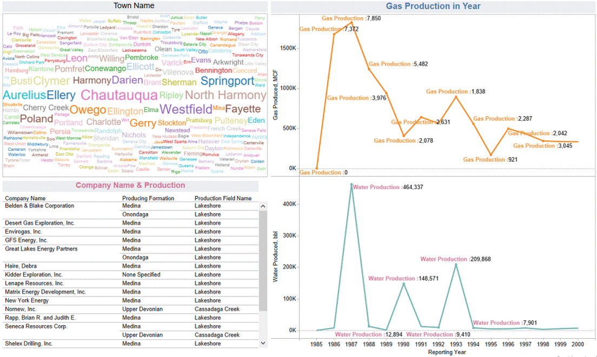

# My_Portfolio

# Madhusudan Prajapati

# Projects

## [**Project 1: Data Analysis with Pandas**](https://github.com/Madhu2511995/Pandas-Library)

  * Pandas is a fast, powerful, flexible and easy to use open source data analysis and manipulation tool in Python.
  * A fast and efficient DataFrame object for data manipulation with integrated indexing.
  * Tools for reading and writing data between in-memory data structures and different formats: CSV and text files, Microsoft Excel, SQL databases, and the fast HDF5 format.
  * Intelligent data alignment and integrated handling of missing data: gain automatic label-based alignment in computations and easily manipulate messy data into an orderly form.
  * Flexible reshaping and pivoting of data sets.
  * Intelligent label-based slicing, fancy indexing, and subsetting of large data sets.
  * Aggregating or transforming data with a powerful group by engine allowing split-apply-combine operations on data sets.
   
   
   
   
   
## [**Project 2: Loan-Predication**](https://github.com/Madhu2511995/Loan-Predication)   
   
  * The dataset has **'Response'**,**'Age'**,**'Job'**,**'Marital Status'**,**'Education'**,**'balance'**,**'housing'**,and **'loan'** columns. It has **'1816 row'** and **'8 columns'**'. 
  * Useing this dataset Predict that a person can get loan or not.
  * **'chi2'** has been used for Feature Selection.
  * I have applide **'Logistic Regression'**, **'Decision Tree'**, **'Random Forest'**, **'SVM'**, and **'KNN'** algorithms.
  * Use Cross Validation for Model Selection, found that the accuracy of the **SVM** is higher than other.
   

## [**Project 3: Heart Disease Predication**](https://github.com/Madhu2511995/Heart-Disease)

* The dataset has **'16 row'**, and **'4239 column'**.
* From the dataset we have to predict the Heart Disease after 10 years.
* **'chi2'** has been used for Feature Selection.
* After Feature Selection found that output depend on these columns **'sysBP'**,**'age'**,**'totChol'**,**'cigsPerDay'**,**'diaBP'**.
* I have applide **'Logistic Regression'**, **'Decision Tree'**, **'Random Forest'**, **'SVM'**, and **'KNN'** algorithms.
* Found that the accuracy of the **Decision Tree** is higher than other.
* Then used flask for deployment the model.

### [**Web App on Heroku**](https://heart-predication.herokuapp.com/)

## [**Project 4: Home Price Predication**](https://github.com/Madhu2511995/Home-Price-Predication)

* The dataset has **'4 row'**, and **'12 column'**.
* Useing this dataset Predict the price of home according to these inputs **'Area'**,**'Bedrooms'**,**'Old'**.
* I have apply **'Decision Tree'** algorithms for model predication.
* Then used flask for deployment the model.

### [**Web App on Heroku**](https://home-price.herokuapp.com/)

## [**Project 5: Alcohol Quality Checker**](https://github.com/Madhu2511995/Alcohol-Quality-Predication)

* The dataset has **5 row**, and **4899 column**. 
* From the dataset we have to predict the **Quality of alcohol** is :**"High"**, or **"Low"**.
* I have apply **Logistic Regression** algorithms for model predication.
* Then used flask for deployment the model.

### [**Web App on Heroku**](https://alchol.herokuapp.com/)

## [**Project 6:Machine Learning With R**](https://github.com/Madhu2511995/Machine-Learning-With-R)

## [**Project 7: Automation with R**](https://github.com/Madhu2511995/Automation)

# Dashboards 

## Dashboard 1 : Diffrent Types of chart in Tableau

## Dashboard 2 : Covid 19

## Dashboard 3 : Oil_and_Gas_Annual_Production__1985_-_2000

